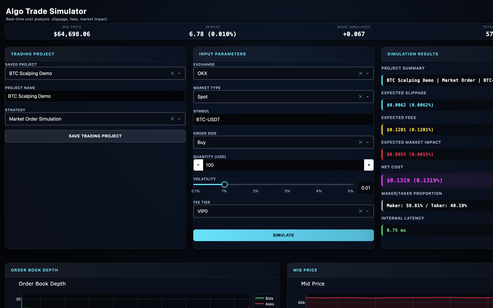

# Algo Trade Simulator

Pre-trade cost tool. Takes an L2 order book and estimates slippage, fees and market impact for a market order. It does not place trades.

**SkillUp Hackathon × IBM SkillsBuild** (solo, IIT Kharagpur)

- [How IBM Bob was used](IBM_BOB.md)
- [Slides](docs/hackathon/Algo_Trade_Simulator.pptx)

## Problem

Backtests and charts show the mid price. A real market order also pays slippage, exchange fees and impact. A small order on a liquid book is cheap. The same notional on a thin book can wipe the edge. After that it is hard to tell if the strategy failed or the fill was expensive.

Most demos also need Redis, a websocket and API keys. If any of that is down, the page is empty.

## Solution

A Dash dashboard on a live or synthetic L2 book. You pick size, side, fee tier and volatility. It returns:

- expected slippage
- fees (VIP0–VIP5, spot / futures)
- Almgren–Chriss style market impact
- maker / taker mix
- net cost

`FEED_SOURCE=auto` uses Redis if you set it, otherwise a local synthetic book. One Docker image is enough for a demo. `/healthz` and `/readyz` are for deploy.



## How it works

```
Feed (redis / websocket / synthetic)
  → Orderbook
  → TradeSimulator (fees, slippage, impact, maker/taker)
  → Dash UI
```

Bad books (one-sided or zero spread) are flagged. Nothing is sent to an exchange.

## IBM Bob

Plan / Ask / Agent on this repo: feed path, slippage units, participation-based impact, Railway boot (skip unconfigured Redis), local CSS. Full note: [IBM_BOB.md](IBM_BOB.md).

## Run locally

```bash
python -m venv .venv
source .venv/bin/activate
pip install -r requirements.txt
python -m trading.src.main
```

http://localhost:8050

```bash
docker compose up --build
```

http://localhost:8080

No Redis or API keys. A fake book is generated if nothing else is connected.

## Railway

Dockerfile + `railway.toml`. Health check is `/healthz`. Do not set `REDIS_HOST=localhost`.

## Feed

`FEED_SOURCE` (default `auto`):

- `auto` — Redis if available, else synthetic
- `synthetic` — always fake data
- `websocket` — `WEBSOCKET_URI`
- `redis` — Redis only

## Env

See `.env.example`. Main ones: `PORT` (8050), `FEED_SOURCE` (auto), `SYMBOL` (BTC-USDT), `REDIS_URL` (optional), `WEB_CONCURRENCY` (1).

Keep workers at 1 unless Redis is set.

## Endpoints

- `/` dashboard
- `/healthz` liveness
- `/readyz` 200 once market data is flowing

## Tests

```bash
pip install -r requirements-dev.txt
pytest
ruff check .
```

## Layout

```
trading/
  data_feeder.py
  stock_data_feeder.py
  tests/
  src/
    app.py
    main.py
    config.py
    data/          # orderbook, redis, synthetic feed, ws client
    models/        # fees, slippage, impact, maker/taker, simulator
    services/      # feed manager + shared state
    ui/            # dash layout / callbacks / css
```

## License

MIT
